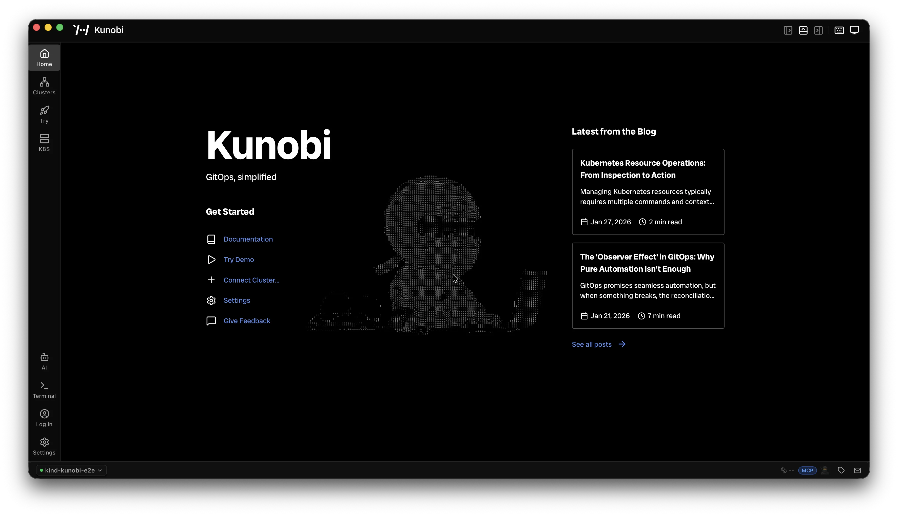
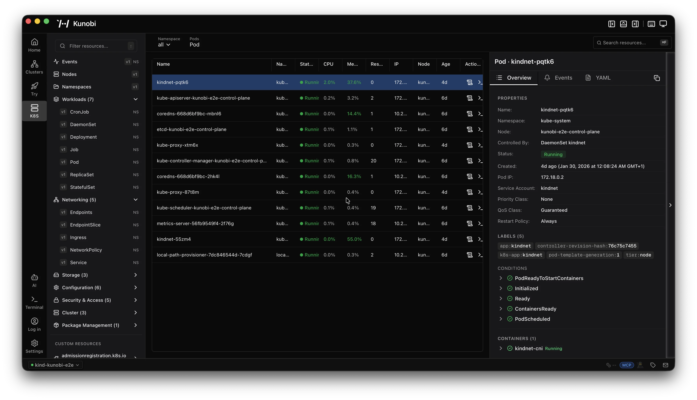
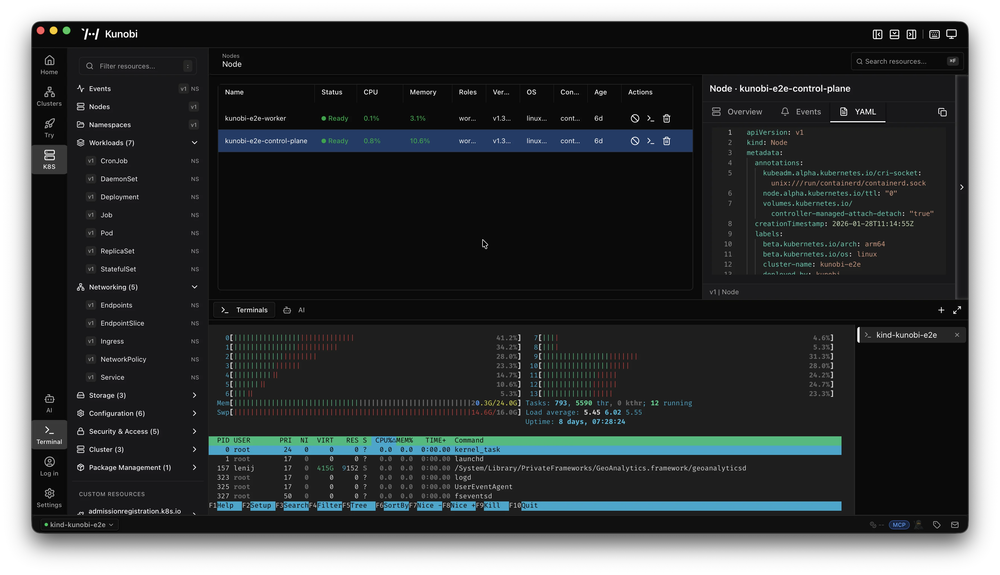
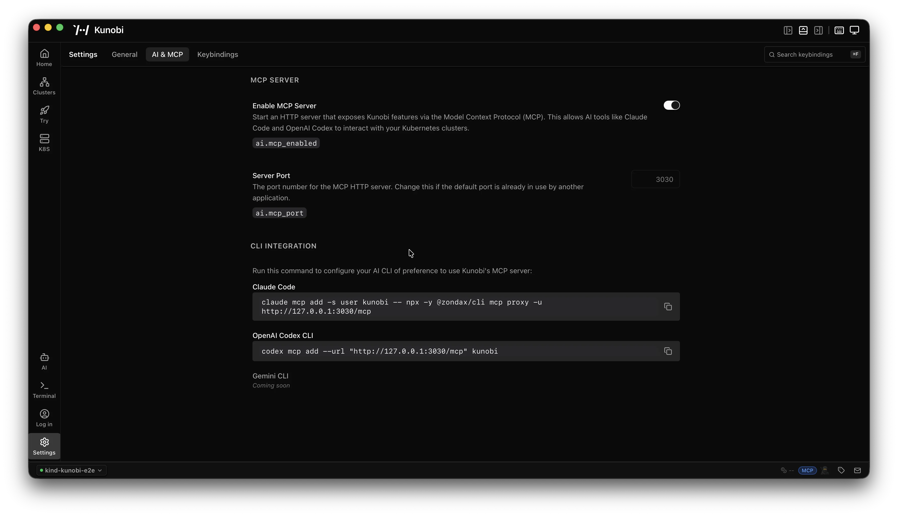

# Kunobi

Native desktop tool for Kubernetes and GitOps. Built on Tauri, not Electron.

  

## Install

Download from [kunobi.ninja/download](https://kunobi.ninja/download). Available for macOS, Linux, and Windows.

## What it does

Kunobi is a desktop app for managing Kubernetes clusters. It reads your kubeconfig, connects to your clusters, and gives you a GUI for the stuff you'd normally do with kubectl or k9s.

Multi-cluster management with keyboard shortcuts. A resource browser with virtual scrolling for large clusters. Split-pane terminals with auto-reconnect. A YAML editor with K8s-aware validation. Flux CD flow graph visualization. Built-in KIND cluster creation for testing locally without touching your real infrastructure.

The whole thing runs natively on your OS. No bundled Chromium, no Electron, no Node.js runtime. Install size is around 30MB, idles at ~100MB of RAM.

## Screenshots

  

  

  

## Community

- [Discussions](https://github.com/kunobi-ninja/kunobi/discussions) for questions, ideas, and feedback
- [Issues](https://github.com/kunobi-ninja/kunobi/issues) for bug reports
- [Twitter / X](https://x.com/_kunobi_)
- [Reddit](https://www.reddit.com/r/kunobi/)

## License

Source-available. See [LICENSE](LICENSE) for details.
