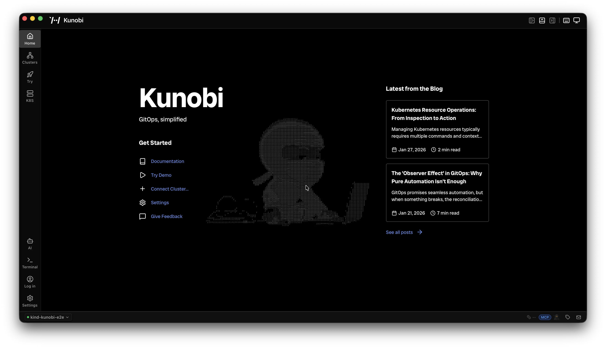
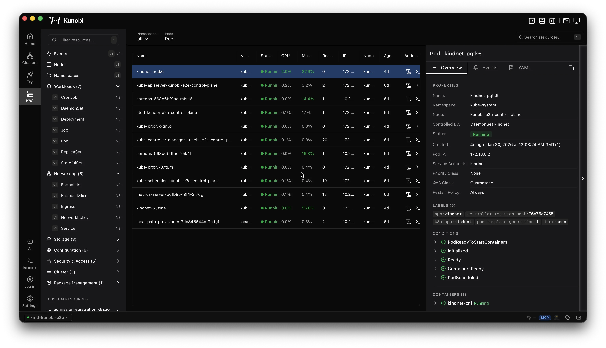
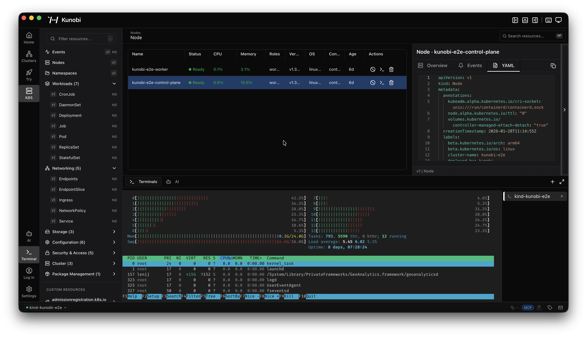
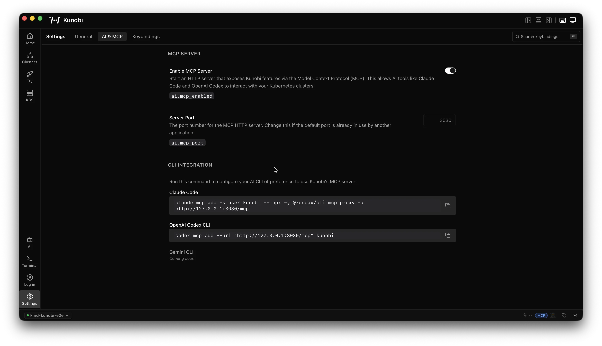

# Kunobi

Native desktop tool for Kubernetes and GitOps. Built on Tauri, not Electron.

<p align="center">
  
</p>

## What it does

Kunobi is a desktop app for managing Kubernetes clusters. It reads your kubeconfig, connects to your clusters, and gives you a GUI for the stuff you'd normally do with kubectl or k9s.

Multi-cluster management with keyboard shortcuts. A resource browser with virtual scrolling for large clusters. Split-pane terminals with auto-reconnect. A YAML editor with K8s-aware validation. Flux CD flow graph visualization. Built-in KIND cluster creation for testing locally without touching your real infrastructure.

The whole thing runs natively on your OS. No bundled Chromium, no Electron, no Node.js runtime. Install size is around 30MB, idles at ~100MB of RAM.

## Screenshots

<p align="center">
  
</p>

<p align="center">
  
</p>

<p align="center">
  
</p>

## Install

### Download

Download from [kunobi.ninja/download](https://kunobi.ninja/download). Available for macOS, Linux, and Windows.

### Homebrew (macOS)

```bash
brew tap kunobi-ninja/kunobi  # If not already added
brew install --cask kunobi
```

The cask is maintained at [kunobi-ninja/homebrew-kunobi](https://github.com/kunobi-ninja/homebrew-kunobi).

### Chocolatey (Windows)

```powershell
choco install kunobi
```

The package is maintained at [kunobi-ninja/chocolatey-kunobi](https://github.com/kunobi-ninja/chocolatey-kunobi).

### Winget (Windows)

```powershell
winget install kunobi-ninja.kunobi
```

The package is maintained at [microsoft/winget-pkgs](https://github.com/microsoft/winget-pkgs). Manifest PRs are submitted automatically from the [kunobi-ninja/winget-pkgs](https://github.com/kunobi-ninja/winget-pkgs) fork.

### APT (Linux)

Kunobi publishes `.deb` packages to a self-hosted APT repository. Two channels are available:

| Channel | Description | Who should use it |
|---------|-------------|-------------------|
| `stable` | Production releases | Most users |
| `unstable` | Pre-releases (RC, Beta, Alpha) | Testers and early adopters |

Stable releases are automatically promoted to the unstable channel, so unstable users always receive stable updates too.

#### Setup

```bash
# Import the GPG signing key
curl -fsSL https://r2.kunobi.ninja/apt/gpg.key | sudo gpg --dearmor -o /usr/share/keyrings/kunobi.gpg

# Add the repository (choose one)

# Stable channel (recommended)
echo "deb [arch=amd64 signed-by=/usr/share/keyrings/kunobi.gpg] https://r2.kunobi.ninja/apt stable main" \
  | sudo tee /etc/apt/sources.list.d/kunobi.list

# OR Unstable channel (pre-releases)
echo "deb [arch=amd64 signed-by=/usr/share/keyrings/kunobi.gpg] https://r2.kunobi.ninja/apt unstable main" \
  | sudo tee /etc/apt/sources.list.d/kunobi.list
```

#### Install and update

```bash
sudo apt update
sudo apt install kunobi
```

Future updates are delivered through the standard `apt upgrade` flow.

### Aqua (macOS and Linux)

[aqua](https://aquaproj.github.io/) can install Kunobi (macOS arm64, Linux x64) from the [aqua-registry](https://github.com/aquaproj/aqua-registry):

```bash
aqua init                       # if not already initialized
aqua g -i kunobi-ninja/kunobi
aqua i
```

[mise](https://mise.jdx.dev/) can also install and manage Kunobi versions (macOS arm64, Linux x64) through aqua-registry:

```bash
mise use aqua:kunobi-ninja/kunobi
```

Kunobi is registered in the [aqua](https://aquaproj.github.io/) registry (`aqua:kunobi-ninja/kunobi`), so it can be used directly by mise.

## Community

- [Discussions](https://github.com/kunobi-ninja/kunobi/discussions) for questions, ideas, and feedback
- [Issues](https://github.com/kunobi-ninja/kunobi/issues) for bug reports
- [Twitter / X](https://x.com/_kunobi_)
- [Reddit](https://www.reddit.com/r/kunobi/)

## License

Source-available. See [LICENSE](LICENSE) for details.
